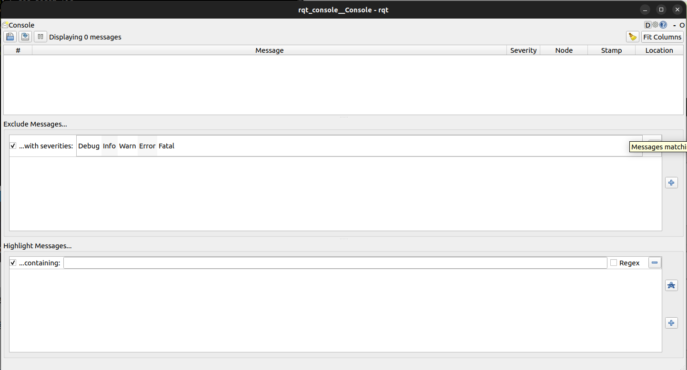

# ROS2 GUIDE
>:warning: Ubuntu 22.04, ROS2 Humble

>:pencil: Andrea Ruo

# Table of contents
1. [Installation](#installation)
    1. [Make sure you have a locale which supports UTF-8](#locale)
    2. [Add the ROS 2 apt repository to your system](#apt)
    3. [Install ROS2 packages](#packages)
    4. [Environment setup](#env_setup)
    5. [Try Talker-Listener example](#try)
2. [Concepts](#concepts)
    1. [Nodes](#nodes)  
    2. [Discovery](#discovery) 
    3. [Interfaces](#interfaces) 
    4. [Topics](#topics) 
    5. [Services](#services) 
    6. [Actions](#actions) 
    7. [Parameters](#parameters) 
    8. [Introspection with command line tools](#Introspection) 
    9. [Launch](#launch)
    10. [Client Libraries](#client_libraries)
3. [Command Line Interface Tools](#cli)
    1. [Understanding Nodes](#Nodes)
    2. [Understanding Topics](#Topics)
    3. [Understanding Services](#Services)
    4. [Understanding Parameters](#Parameters)
    5. [Understanding Actions](#Actions)
    6. [rqt_console](#rqt_console)
    7. [ros2 bag](#ros2_bag)
    8. [Verification and installation packages](#verification)

4. [Workspace and Packages](#WaP)
    1. [Create a Workspace](#create_ws)
    2. [Create a Package](#create_package)
        1. [C++ package](#cpp_pkg)
        2. [Python package](#py_pkg)
    3. [Costumize a Package](#costumize_pkg)
    4. [Build Workspace](#build_ws)


5. [Create a Publisher and Subscriber](#pubsub)
    1. [C++ Publisher and Subscriber](#cpp_pubsub)
    2. [Python Publisher and Subscriber](#py_pubsub)

6. [Create my_interfaces package](#my_interfaces)

7. [Create a Publisher and Subscriber with my_interfaces](#pubsub_my_interfaces)
    1. [C++ Publisher and Subscriber with my_interfaces](#cpp_pubsub_my_interfaces)
    2. [Python Publisher and Subscriber with my_interfaces](#py_pubsub_my_interfaces)

8. [Create Service and Client using my_interface](#service)
    1. [C++ Service and Client with my_interfaces](#cpp_service)
    2. [Python Service and Client with my_interfaces](#py_service)

9. [Create Action Server and Client using my_interface](#action)
    1. [C++ Action Server and Client with my_interfaces](#cpp_action)
    2. [Python Action Server and Client with my_interfaces](#py_action)

<div style="page-break-after: always;"></div>

# Installation (DEBIAN) <a name="installation"></a>

## 1. Make sure you have a locale which supports UTF-8 <a name="locale"></a>

```bash
locale  # check for UTF-8

sudo apt update && sudo apt install locales
sudo locale-gen en_US en_US.UTF-8
sudo update-locale LC_ALL=en_US.UTF-8 LANG=en_US.UTF-8
export LANG=en_US.UTF-8

locale  # verify settings
```

## 2. Add the ROS 2 apt repository to your system <a name="apt"></a>

First ensure that the Ubuntu Universe repository is enabled.
```bash
sudo apt install software-properties-common
sudo add-apt-repository universe
```
Now add the ROS 2 GPG key with apt.

```bash
sudo apt update && sudo apt install curl -y
sudo curl -sSL https://raw.githubusercontent.com/ros/rosdistro/master/ros.key -o /usr/share/keyrings/ros-archive-keyring.gpg
```
Then add the repository to your sources list.

```bash
echo "deb [arch=$(dpkg --print-architecture) signed-by=/usr/share/keyrings/ros-archive-keyring.gpg] http://packages.ros.org/ros2/ubuntu $(. /etc/os-release && echo $UBUNTU_CODENAME) main" | sudo tee /etc/apt/sources.list.d/ros2.list > /dev/null
```

## 3. Install ROS2 packages <a name="packages"></a>

Update your apt repository caches after setting up the repositories. It is always recommended that you ensure your system is up to date before installing new packages.

<div style="page-break-after: always;"></div>

```bash
sudo apt update
sudo apt upgrade
```
Desktop Install (Recommended): ROS, RViz, demos, tutorials.
```bash
sudo apt install ros-humble-desktop
```

## 4. Environment setup <a name="env_setup"></a>

Set up your environment by going to .bashrc and typing at the end:
```bash
# source ros2
export ROS_DOMAIN_ID=0
source /opt/ros/humble/setup.bash
source /usr/share/colcon_argcomplete/hook/colcon-argcomplete.bash
```
>:pencil: The .bashrc file is located in the ``Home`` folder as hidden file.

## 5. Try Talker-Listener example <a name="try"></a>

In one terminal run:
```bash
ros2 run demo_nodes_cpp talker
```

In another terminal run:
```bash
ros2 run demo_nodes_py listener
```

You should see the talker saying that it’s Publishing messages and the listener saying I heard those messages. This verifies both the C++ and Python APIs are working properly.

<div style="page-break-after: always;"></div>

# Concepts <a name="concepts"></a>

## Nodes <a name="nodes"></a>
A __node__ is a participant in the ROS 2 graph, which uses a client library to communicate with other nodes. Nodes can communicate with other nodes within the same process, in a different process, or on a different machine. Nodes are typically the unit of computation in a ROS graph; each node should do one logical thing.

Nodes can:
- Publish to named ``topics`` to deliver data to other nodes;
- Subscribe to named ``topics`` to get data from other nodes: 
- Act as a ``service client`` to have another node perform a computation on their behalf;
- Act as a ``service server`` to provide functionality to other nodes. For long-running computations;
- Act as an ``action client`` to have another node perform it on their behalf;
- Act as an ``action server`` to provide functionality to other nodes.

Connections between nodes are established through a distributed discovery process.

## Discovery <a name="discovery"></a>
``Discovery of nodes`` happens automatically through the underlying middleware of ROS 2. It can be summarized as follows:

When a node is started, it advertises its presence to other nodes on the network with the same ROS domain (set with the ``ROS_DOMAIN_ID`` environment variable). Nodes respond to this advertisement with information about themselves so that the appropriate connections can be made and the nodes can communicate.

Nodes periodically advertise their presence so that connections can be made with new-found entities, even after the initial discovery period.

Nodes advertise to other nodes when they go offline.

## Interfaces <a name="interfaces"></a>
ROS applications typically communicate through interfaces of one of three types: __topics__, __services__, or __actions__:
1) msg: ``.msg`` files are simple text files that describe the fields of a ROS message.
2) srv:`` .srv`` files describe a service. They are composed of two parts: a request and a response. 
3) action: ``.action`` files describe actions. They are composed of three parts: a goal, a result, and feedback. 

<div style="page-break-after: always;"></div>

### 1. Messages
__Messages__ are a way for a ROS 2 node to send data on the network to other ROS nodes, with no response expected. Messages are described and defined in ``.msg`` files in the msg/ directory of a ROS package. ``.msg`` files are composed of two parts: __fields__ and __constants__.

>:pencil: For instance, if a ROS 2 node reads temperature data from a sensor, it can then publish that data on the ROS 2 network using a ``Temperature`` message. Other nodes on the ROS 2 network can subscribe to that data and receive the ``Temperature`` message

Each __field__ consists of a __type__ and a __name__, separated by a space:
```
fieldtype1 fieldname1
fieldtype2 fieldname2
fieldtype3 fieldname3
```
For example:
```
int32 my_int
string my_string
```
__Field types__ can be:
- a [built-in-type](https://docs.ros.org/en/humble/Concepts/Basic/About-Interfaces.html#field-types);
- names of Message descriptions defined on their own, such as “geometry_msgs/PoseStamped”.

Regarding names, __field names__ must be lowercase alphanumeric characters with underscores for separating words.

__Default values__ can be set to any field in the message type. For example:
```
uint8 x 42
int16 y -2000
string full_name "John Doe"
int32[] samples [-200, -100, 0, 100, 200]
```
Each __constant__ definition is like a field description with a default value, except that this value can never be changed programatically. This value assignment is indicated by use of an equal ‘=’ sign. For example:

```
int32 X=123
int32 Y=-123
string FOO="foo"
string EXAMPLE='bar'
```
>:pencil: Constants names have to be UPPERCASE

### 2. Services
__Services__ are a request/response communication, where the client (requester) is waiting for the server (responder) to make a short computation and return a result.

Services are described and defined in ``.srv`` files in the ``srv/`` directory of a ROS package.

A service description file consists of a request and a response msg type, separated by ``---``, as shown below:
```
# request constants
int8 FOO=1
int8 BAR=2
# request fields
int8 foobar
another_pkg/AnotherMessage msg
---
# response constants
uint32 SECRET=123456
# response fields
another_pkg/YetAnotherMessage val
CustomMessageDefinedInThisPackage value
uint32 an_integer
```

>:pencil: You cannot embed another service inside of a service.

### 3. Actions
Actions are a long-running request/response communication, where the action client (requester) is waiting for the action server (the responder) to take some action and return a result. 

>:pencil: In contrast to services, actions can be long-running (many seconds or minutes), provide feedback while they are happening, and can be interrupted.

Action definitions have the following form:

```
<request_type> <request_fieldname>
---
<response_type> <response_fieldname>
---
<feedback_type> <feedback_fieldname>
```

>:pencil: The ``<request_type>``, ``<response_type>``, and ``<feedback_type>`` follow all of the same rules as the ``<type>`` for a message. The ``<request_fieldname>``, ``<response_fieldname>``, and ``<feedback_fieldname>`` follow all of the same rules as the ``<fieldname>`` for a message.

<div style="page-break-after: always;"></div>

## Topics <a name="topics"></a>
__Topics__ should be used for continuous data streams, like sensor data, robot state, etc.

A publish/subscribe system is one in which there are producers of data (publishers) and consumers of data (subscribers). The __publishers__ and __subscribers__ know how to contact each other through the concept of a “topic”, which is a common name so that the entites can find each other. Any publishers and subscribers that are on the same topic name can directly communicate with each other.

When data is published to the topic by any of the publishers, all subscribers in the system will receive the data. This system is also known as a “bus”, since it somewhat resembles a device bus from electrical engineering. 

>:pencil: ROS 2 is _“anonymous”_. This means that when a subscriber gets a piece of data, it doesn’t generally know or care which publisher originally sent it (though it can find out if it wants). The benefit to this architecture is that publishers and subscribers can be swapped out at will without affecting the rest of the system.

>:pencil: The publish/subscribe system is _“strongly-typed”_. This means that the data that is published and subscribed is described by a message type, and the publisher and subscriber must agree on the message type.

## Services <a name="services"></a>
A __service__ refers to a remote procedure call. In other words, a node can make a remote procedure call to another node which will do a computation and return a result.

In ROS 2, services are expected to return quickly, as the client is generally waiting on the result. Services should never be used for longer running processes. If you have a service that will be doing a long-running computation, consider using an action instead.

Services are identified by a service name, which looks much like a topic name.

A service consists of two parts: the __service server__ and the __service client__.
- ``Service server``: is the entity that will accept a remote procedure request, and perform some computation on it.

>:warning: There should only ever be one service server per service name.

- ``Service client``: is an entity that will request a remote service server to perform a computation on its behalf.

>:warning: Unlike the service server, there can be arbitrary numbers of service clients using the same service name.

<div style="page-break-after: always;"></div>

## Actions <a name="actions"></a>
An __action__ refers to a long-running remote procedure call with feedback and the ability to cancel or preempt the goal. 

>:pencil: For instance, the high-level state machine running a robot may call an action to tell the navigation subsystem to travel to a waypoint, which may take several seconds (or minutes) to do. Along the way, the navigation subsystem can provide feedback on how far along it is, and the high-level state machine has the option to cancel or preempt the travel to that waypoint.

Actions are identified by an action name, which looks much like a topic name.

An action consists of two parts: the __action server__ and the __action client__.

- ``Action server``: is the entity that will accept the remote procedure request and perform some procedure on it. It is also responsible for sending out feedback as the action progresses and should react to cancellation/preemption requests.

>:warning: There should only ever be one action server per action name. 

- ``Action client``: is an entity that will request a remote action server to perform a procedure on its behalf. 

>:warning: Unlike the action server, there can be arbitrary numbers of action clients using the same action name.

## Parameters <a name="parameters"></a>
__Parameters__ are associated with individual nodes. Parameters are used to configure nodes at startup (and during runtime), without changing the code. The lifetime of a parameter is tied to the lifetime of the node.

Parameters are addressed by ``node name``, ``node namespace``, ``parameter name``, and ``parameter namespace`` (providing a parameter namespace is optional).

>:pencil: For example, let's consider a node with the name ``robot_controller`` and a parameter named ``max_speed``. If the parameter is within the namespace of that node, it might be identified as ``robot_controller/max_speed``. This enables having parameters with the same name but distinct to different nodes by utilizing the node's namespace.

>Furthermore, the ``parameter namespace`` is an additional subdivision within the node's namespace, allowing for further organization and hierarchy. For example, a parameter could be ``robot_controller/motion_parameters/max_speed``. In this case, ``motion_parameters`` is a parameter namespace that helps group parameters related to the robot's motion parameters under a specific category.

<div style="page-break-after: always;"></div>

Each parameter consists of a __key__, a __value__, and a __descriptor__. 
- The __key__ is a string;
- The __value__ is one of the following types: ``bool``, ``int64``, ``float64``, ``string``, ``byte[]``, ``bool[]``, ``int64[]``, ``float64[]`` or ``string[]``. 
- By default all __descriptors__ are empty, but can contain parameter descriptions, value ranges, type information, and additional constraints.

By default, a node needs to declare all of the parameters that it will accept during its lifetime.

>:pencil: For some types of nodes, not all of the parameters will be known ahead of time. In these cases, the node can be instantiated with ``allow_undeclared_parameters`` set to ``true``, which will allow parameters to be get and set on the node even if they haven’t been declared.

Each parameter on a ROS 2 node has one of the pre-defined parameter types (``bool``, ``int64``, ``float64``, ``string``, ``byte[]``, ``bool[]``, ``int64[]``, ``float64[]`` or ``string[]``).

>:pencil: If a parameter needs to be multiple different types, and the code using the parameter can handle it, this default behavior can be changed. When the parameter is declared, it should be declared using a ``ParameterDescriptor`` with the ``dynamic_typing`` member variable set to ``true``.

A ROS 2 node can register two different types of callbacks <u>to be informed when changes are happening to parameters</u>. Both of the callbacks are optional.
- __set parameters__ callback:
    - Can be set by calling ``add_on_set_parameters_callback`` from the node API;
    - The callback is passed a list of immutable ``Parameter`` objects, and returns an ``rcl_interfaces/msg/SetParametersResult``;
    - The main purpose of this callback is to give the user the ability to inspect the upcoming change to the parameter and explicitly reject the change.

>:pencil: Let's consider a ROS 2 node that manages the speed of a robot as a parameter. The __set parameters__ callback could be used to control and potentially reject sudden changes to the robot's speed that might cause issues.
>```python
>import rclpy
>from rcl_interfaces.msg import SetParametersResult
>from my_robot_control import RobotControl
>
>def set_parameter_callback(parameters):
>    for param in parameters:
>        if param.name == 'robot_speed' and param.value > 5.0:
>            # Reject the change if the new speed is too high
>            return SetParametersResult(successful=False, reason='Speed exceeds limit')
>    # Accept the change for other parameters
>    return SetParametersResult(successful=True)
>
>def main():
>    rclpy.init()
>    node = rclpy.create_node('robot_controller')
>
>    # Register the "set parameter" callback
>    node.add_on_set_parameters_callback(set_parameter_callback)
>
>    robot_control = RobotControl()
>
>    try:
>        rclpy.spin(node)
>    except KeyboardInterrupt:
>        pass
>    finally:
>        node.destroy_node()
>        rclpy.shutdown()
>
>if __name__ == '__main__':
>    main()
>```
>In this example, if someone attempts to set the robot's speed above 5.0 via parameters, the callback will reject the change and provide a specific reason.

- __on parameter event__ callback:
    - Can be set by calling ``on_parameter_event`` from the parameter client APIs.
    - The callback is passed an ``rcl_interfaces/msg/ParameterEvent`` object, and returns nothing. This callback will be called after all parameters in the input event have been declared, changed, or deleted.
    - The main purpose of this callback is to give the user the ability to react to changes from parameters that have successfully been accepted.

>:pencil: Suppose we want to log an event every time the robot's configuration is modified. We could use an __on parameter event__ callback to capture this event and take corresponding actions. 
>```python
>import rclpy
>from rcl_interfaces.msg import ParameterEvent
>from my_robot_control import RobotControl
>
>def on_parameter_event_callback(parameter_event):
>    if 'robot_config' in parameter_event.changed_parameters:
>        # Perform specific actions when the robot's configuration changes
>        print("The robot's configuration has been modified:", parameter_event.changed_parameters['robot_config'])
>
>def main():
>    rclpy.init()
>    node = rclpy.create_node('robot_monitor')
>
>    # Register the "on parameter event" callback
>    node.on_parameter_event(on_parameter_event_callback)
>
>    try:
>        rclpy.spin(node)
>    except KeyboardInterrupt:
>        pass
>    finally:
>        node.destroy_node()
>        rclpy.shutdown()
>
>if __name__ == '__main__':
>    main()
>```
>In this example, every time the robot's configuration changes, the __on parameter event__ callback is invoked, allowing the node to perform specific actions in response to this event.

In addition, regarding parameters, there are other concepts to be aware of:
1) __Interacting with parameters__: [External processes](https://docs.ros.org/en/humble/Concepts/Basic/About-Parameters.html#interacting-with-parameters) can perform parameter operations via parameter services that are created by default when a node is instantiated;
2) __Setting initial parameter values when running a node__: Initial parameter values can be set when running the node either through individual command-line arguments, or through YAML files;
3) __Setting initial parameter values when launching nodes__: Initial parameter values can also be set when running the node through the ROS 2 launch facility;
4) __Manipulating parameter values at runtime__: The ``ros2 param`` command is the general way to interact with parameters for nodes that are already running. ``ros2 param`` uses the [parameter service API](https://docs.ros.org/en/humble/Concepts/Basic/About-Parameters.html#interacting-with-parameters) to perform the various operations.

## Introspection with command line tools <a name="Introspection"></a>
ROS 2 includes a suite of __command-line tools for introspecting a ROS 2 system__. The main entry point for the tools is the command ``ros2``, which itself has various sub-commands for introspecting and working with nodes, topics, services, and more.

To see all available sub-commands run:
```bash
ros2 --help
```

Examples of sub-commands that are available include:

- ``action``: Introspect/interact with ROS actions;
- ``bag``: Record/play a rosbag;
- ``component``: Manage component containers;
- ``daemon``: Introspect/configure the ROS 2 daemon;
- ``doctor``: Check ROS setup for potential issues;
- ``interface``: Show information about ROS interfaces;
- ``launch``: Run/introspect a launch file;
- ``node``: Introspect ROS nodes;
- ``param``: Introspect/configure parameters on a node;
- ``pkg``: Introspect ROS packages;
- ``run``: Run ROS nodes;
- ``security``: Configure security settings;
- ``service``: Introspect/call ROS services;
- ``test``: Run a ROS launch test;
- ``topic``: Introspect/publish ROS topics.

## Launch <a name="launch"></a>
A ROS 2 system typically consists of many nodes running across many different processes. While it is possible to run each of these nodes separately, it gets cumbersome quite quickly.

The __launch system__ in ROS 2 is meant to automate the running of many nodes with a single command. It helps the user describe the configuration of their system and then executes it as described. The configuration of the system includes what programs to run, where to run them, what arguments to pass them.

All of the above is specified in a __launch file__, which can be written in Python, XML, or YAML. This launch file can then be run using the ``ros2 launch`` command, and all of the nodes specified will be run.

For example: 
```python
from launch import LaunchDescription
from launch_ros.actions import Node

def generate_launch_description():
    return LaunchDescription([
        Node(
            package='demo_nodes_cpp',
            executable='talker',
            parameters=[{
                'serial_port': '/dev/ttyUSB0',
            }],
            remapping=[
                ('\scan', '\scan1'),
            ]
        ),
        Node(
            package='demo_nodes_cpp',
            executable='listener',
            namespace='/scanner2',
            parameters=[{
                'serial_port': '/dev/ttyUSB1',
            }],
        )
    ])
```

<div style="page-break-after: always;"></div>

## Client Libraries <a name="client_libraries"></a>
__Client libraries__ are the APIs that allow users to implement their ROS 2 code. Using client libraries, users gain access to ROS 2 concepts such as __nodes__, __topics__, __services__, etc. 

>:pencil: Nodes written using different client libraries are able to share messages with each other because all client libraries implement code generators that provide users with the capability to interact with ROS 2 interface files in the respective language.

### 1. The rclpp package
The __ROS Client Library for C++__ (``rclcpp``) is the user facing, C++ idiomatic interface which provides all of the ROS client functionality like creating nodes, publishers, and subscriptions. 

``rclcpp`` makes use of all the features of C++ and C++17 to make the interface as easy to use as possible, but since it reuses the implementation in ``rcl`` it is able maintain a consistent behavior with the other client libraries that use the ``rcl`` API.

### 2. The rclpy package
The __ROS Client Library for Python__ (``rclpy``) is the Python counterpart to the C++ client library. Like the C++ client library, ``rclpy`` also builds on top of the ``rcl`` C API for its implementation. 

By using the ``rcl`` API in the implementation, it stays consistent with the other client libraries in terms of feature parity and behavior. 


### 3. Common functionality: rcl
Most of the functionality found in a client library is not specific to the programming language of the client library. 

Client libraries make use of a __common core ROS Client Library__ (``RCL``) interface that implements logic and behavior of ROS concepts that is not language-specific. As a result, client libraries only need to wrap the common functionality in the ``RCL`` with foreign function interfaces. This keeps client libraries thinner and easier to develop. For this reason the common ``RCL`` functionality is exposed with C interfaces as the C language is typically the easiest language for client libraries to wrap.

>:pencil: Client library concepts that require language-specific features/properties are not implemented in the RCL but instead are implemented in each client library. For example, threading models used by “spin” functions will have implementations that are specific to the language of the client library.

<div style="page-break-after: always;"></div>

# Command Line Interface Tools <a name="cli"></a>

## Understanding Nodes <a name="Nodes"></a>
Each node in ROS should be responsible for a single, modular purpose, e.g. controlling the wheel motors or publishing the sensor data from a laser range-finder. Each node can send and receive data from other nodes via topics, services, actions, or parameters.


[Animated image here](https://docs.ros.org/en/humble/_images/Nodes-TopicandService.gif)


### 1. ros2 run
The command __ros2 run__ launches an executable from a package.
```bash
ros2 run <package_name> <executable_name>
```

### 2. ros2 node list
__ros2 node list__ will show you the names of all running nodes. This is especially useful when you want to interact with a node, or when you have a system running many nodes and need to keep track of them.
```bash
ros2 node list
```

### 3. Remapping
__Remapping__ allows you to reassign default node properties, like node name, topic names, service names, etc., to custom values. 

<div style="page-break-after: always;"></div>

- Names within a node (e.g. topics/services) can be remapped using the syntax:
```bash
ros2 run <package_name> <executable_name> --ros-args -r <old_name>:=<new_name>
```
- The name/namespace of the node itself can be remapped using the syntax:
```bash
# remap node name
ros2 run <package_name> <executable_name> --ros-args -r __node:=<new_node_name>

# remap node namespace
ros2 run <package_name> <executable_name> --ros-args -r __ns:=<new_node_namespace>
``` 

### 4. ros2 node info
Now that you know the names of your nodes, you can access more information about them with:
```bash
ros2 node info <node_name>
```
__ros2 node info__ returns a list of subscribers, publishers, services, and actions. 


## Understanding Topics <a name="Topics"></a>
ROS 2 breaks complex systems down into many modular nodes. Topics are a vital element of the ROS graph that act as a bus for nodes to exchange messages.


[Animated image here](https://docs.ros.org/en/humble/_images/Topic-MultiplePublisherandMultipleSubscriber.gif)

A node may publish data to any number of topics and simultaneously have subscriptions to any number of topics.
Topics are one of the main ways in which data is moved between nodes and therefore between different parts of the system.

### 1. rqt-graph
__rqt_graph__ is used to visualize the changing nodes and topics, as well as the connections between them. To run rqt_graph, open a new terminal and enter the command:
```bash
rqt_graph
```


### 2. ros2 topic list
Running the __ros2 topic list__ command in a new terminal:
```bash
ros2 topic list
``` 
will return a list of all the topics currently active in the system. 
>:pencil: ``ros2 topic list -t``: will return the same list of topics, this time with the topic type appended in brackets.

### 3. ros2 topic echo
To see the data being published on a topic, use:
```bash
ros2 topic echo <topic_name>
```

<div style="page-break-after: always;"></div>

### 4. ros2 interface show
Nodes send data over topics using messages. Publishers and subscribers must send and receive the same type of message to communicate. 

We can run:
```bash
ros2 interface show <msg type>
```
to learn the details of the msg type. Which will return something like:
```bash
    Vector3  linear
            float64 x
            float64 y
            float64 z
    Vector3  angular
            float64 x
            float64 y
            float64 z
```

### 5. ros2 topic pub
It is possible to publish data into a topic directly from the command line using:
```bash
ros2 topic pub <topic_name> <msg_type> '<args>'
```

>:warning: It’s important to note that ``'<args>'`` needs to be input in YAML syntax. 

Input the full command like:
```bash
ros2 topic pub --once /turtle1/cmd_vel geometry_msgs/msg/Twist "{linear: {x: 2.0, y: 0.0, z: 0.0}, angular: {x: 0.0, y: 0.0, z: 1.8}}"
ros2 topic pub /emotion std_msgs/msg/String "{data: 'Hello from terminal'}"
ros2 topic pub /enable std_msgs/msg/Bool "{data: True}"
```
>:pencil: ``--once`` is an optional argument meaning “publish one message then exit”.


<div style="page-break-after: always;"></div>

### 6. ros2 topic hz
__ros2 topic hz__ is a useful tool for measuring the publishing rate of a topic. It will return the publishing rate of a topic in hertz (Hz), i.e. the number of messages published per second.
```bash
ros2 topic hz <topic_name>
```

## Understanding Services <a name="Services"></a>
__Services__ are another method of communication for nodes in the ROS graph. Services are based on a call-and-response model versus the publisher-subscriber model of topics. While topics allow nodes to subscribe to data streams and get continual updates, services only provide data when they are specifically called by a client.


[Animated image here](https://docs.ros.org/en/humble/_images/Service-MultipleServiceClient.gif)


### 1. ros2 service list
Running the __ros2 service list__ command in a new terminal will return a list of all the services currently active in the system.
```bash
ros2 service list
```

### 2. ros2 service type
Services have types that describe how the request and response data of a service is structured. Service types are defined similarly to topic types, except service types have two parts: one message for the request and another for the response.

<div style="page-break-after: always;"></div>

To find out the type of a service, use the command:

```bash
ros2 service type <service_name>
``` 

>:pencil: To see the types of all the active services at the same time, you can append the ``--show-types`` option, abbreviated as ``-t``, to the list command:
>```bash
>ros2 service list -t
>```

### 3. ros2 service find
If you want to find all the services of a specific type, you can use the command:

```bash
ros2 service find <type_name>
```

### 4. ros2 interface show
To see the structure of a service type, use the command:

```bash
ros2 interface show <service_type>
```
Which will return something like:
```bash
float32 x
float32 y
float32 theta
string name 
---
string name
```
The information above the ``---`` line tells us the structure of the request data, and the information below the ``---`` line tells us the structure of the response data.

### 5. ros2 service call
It is possible to call a service using:

```bash
ros2 service call <service_name> <service_type> <arguments>
```
Where the ``<arguments>`` part is optional.

## Understanding Parameters <a name="Parameters"></a>
A __parameter__ is a configuration value of a node. You can think of parameters as node settings. A node can store parameters as integers, floats, booleans, strings, and lists. In ROS 2, each node maintains its own parameters.

### 1. ros2 param list
To see the parameters belonging to your nodes, open a new terminal and enter the command:
```bash
ros2 param list
```
>:pencil: Every node has the parameter ``use_sim_time``.

### 2. ros2 param get
To display the type and current value of a parameter, use the command:
```bash
ros2 param get <node_name> <parameter_name>
```

### 3. ros2 param set
To change a parameter’s value at runtime, use the command:
```bash
ros2 param set <node_name> <parameter_name> <value>
```
>:pencil: Setting parameters with the ``set`` command will only change them in your current session, not permanently. However, you can save your settings and reload them the next time you start a node.

### 4. ros2 param dump
You can view all of a node’s current parameter values by using the command:
```bash
ros2 param dump <node_name>
```
It is possible to save your current configuration of the node's parameters to a .yaml file using the command:
```bash
ros2 param dump <node_name> > <file_name>.yaml
```
>:pencil: Dumping parameters comes in handy if you want to reload the node with the same parameters in the future.

### 5. ros2 param load
You can load parameters from a file to a currently running node using the command:
```bash
ros2 param load <node_name> <parameter_file>
```

### 6. Load parameter file on node startup
To start the same node using your saved parameter values, use:
```bash
ros2 run <package_name> <executable_name> --ros-args --params-file <file_name>
```

## Understanding Actions <a name="Actions"></a>
__Actions__ are one of the communication types in ROS 2 and are intended for long running tasks. They consist of three parts: a goal, feedback, and a result.

Actions are built on topics and services. Their functionality is similar to services, except actions can be canceled. They also provide steady feedback, as opposed to services which return a single response.

Actions use a client-server model, similar to the publisher-subscriber model.  An “action client” node sends a goal to an “action server” node that acknowledges the goal and returns a stream of feedback and a result.

>:pencil: A robot system would likely use actions for navigation. An action goal could tell a robot to travel to a position. While the robot navigates to the position, it can send updates along the way (i.e. feedback), and then a final result message once it’s reached its destination.


[Animated image here](https://docs.ros.org/en/humble/_images/Action-SingleActionClient.gif)

### 1. ros2 node info
To see the list of actions a node provides, open a new terminal and run the command:
```bash
ros2 node info <node_name>
```
Which will return a list of node's subscribers, publishers, services, action servers and action clients. For example:
```bash
/turtlesim
  Subscribers:
    /parameter_events: rcl_interfaces/msg/ParameterEvent
    /turtle1/cmd_vel: geometry_msgs/msg/Twist
  Publishers:
    /parameter_events: rcl_interfaces/msg/ParameterEvent
    /rosout: rcl_interfaces/msg/Log
    /turtle1/color_sensor: turtlesim/msg/Color
    /turtle1/pose: turtlesim/msg/Pose
  Service Servers:
    /clear: std_srvs/srv/Empty
    /kill: turtlesim/srv/Kill
    /reset: std_srvs/srv/Empty
    /spawn: turtlesim/srv/Spawn
  Service Clients:

  Action Servers:
    /turtle1/rotate_absolute: turtlesim/action/RotateAbsolute
  Action Clients:
```

### 2. ros2 action list
To identify all the actions in the ROS graph, run the command:
```bash
ros2 action list
```
>:pencil: To find action's type, run the command:
>```bash
>ros2 action list -t
>```

### 3. ros2 action info
You can further introspect the action with the command:
```bash
ros2 action info <action_type>
```
Which will return something like:
```bash
Action: /turtle1/rotate_absolute
Action clients: 1
    /teleop_turtle
Action servers: 1
    /turtlesim
```

### 4. ros2 interface show
To see the structure of an action type, run the command:
```bash
ros2 interface show <action_type>
```
Which will return something like:
```bash
#The desired heading in radians
float32 theta
---
#The angular displacement in radians to the starting position
float32 delta
---
#The remaining rotation in radians
float32 remaining
```
The section of this message above the first ``---`` is the structure (data type and name) of the goal request. The next section is the structure of the result. The last section is the structure of the feedback.

### 5. ros2 action send_goal
To send a goal to an action server, use the command:
```bash
ros2 action send_goal <action_name> <action_type> <values>
```
>:warning: The ``<values>`` need to be in YAML syntax.

<div style="page-break-after: always;"></div>

For example:
```bash
ros2 action send_goal /turtle1/rotate_absolute turtlesim/action/RotateAbsolute "{theta: 1.57}"
```
>:pencil: To see the feedback of the goal, add ``--feedback`` to the ``ros2 action send_goal`` command. In this way, you will continue to receive feedback, until the goal is complete.

## rqt_console <a name="rqt_console"></a>
__rqt_console__ is a GUI tool used to introspect log messages in ROS 2. Typically, log messages show up in your terminal. With rqt_console, you can collect those messages over time, view them closely and in a more organized manner, filter them, save them and even reload the saved files to introspect at a different time.

Nodes use logs to output messages concerning events and status in a variety of ways. Their content is usually informational, for the sake of the user.

Start rqt_console in a new terminal with the following command:
```bash
ros2 run rqt_console rqt_console
```



The first section of the console is where log messages from your system will display.

In the middle you have the option to filter messages by excluding severity levels. You can also add more exclusion filters using the plus-sign button to the right.

The bottom section is for highlighting messages that include a string you input. You can add more filters to this section as well.

<div style="page-break-after: always;"></div>

### 1. Logger Levels 
ROS 2’s logger levels are ordered by severity:
- ``Fatal`` messages indicate the system is going to terminate to try to protect itself from detriment.
- ``Error`` messages indicate significant issues that won’t necessarily damage the system, but are preventing it from functioning properly.
- ``Warn`` messages indicate unexpected activity or non-ideal results that might represent a deeper issue, but don’t harm functionality outright.
- ``Info`` messages indicate event and status updates that serve as a visual verification that the system is running as expected.
- ``Debug`` messages detail the entire step-by-step process of the system execution.

## ros2 bag <a name="ros2_bag"></a>
__ros2 bag__ is a command line tool for recording data published on topics in your system. It accumulates the data passed on any number of topics and saves it in a database. You can then replay the data to reproduce the results of your tests and experiments. Recording topics is also a great way to share your work and allow others to recreate it.

>:warning:You should have ros2 bag installed as a part of your regular ROS 2 setup. If you installed ROS from Debian packages on Linux and your system doesn’t recognize the command, install it like so:
>```bash
>sudo apt-get install ros-humble-ros2bag \ros-humble-rosbag2-storage-default-plugins
>```

### 1. Setup
To record data, you need to create a directory to store the database file. Open a new terminal and run:
```bash
mkdir bag_files
cd bag_files
```

### 2. ros2 bag record
__ros2 bag__ can only record data from published messages in topics. To record data from a topic, open a new terminal and run the command:
```bash
ros2 bag record <topic_name>
```
>:warning: Before running this command on your chosen topic, open a new terminal and move into the bag_files directory you created earlier, because the rosbag file will save in the directory where you run it.

Press ``Ctrl+C`` to stop recording.

### 3. ros2 bag info
You can see details about your recording by running:
```bash
ros2 bag info <bag_file_name>
```

### 4. ros2 bag play
To replay the data from a bag file, open a new terminal and run the command:
```bash
ros2 bag play <bag_file_name>
```

## Verification and installation packages <a name="verification"></a>
All the avaiable packages can be found at the following [link](https://index.ros.org/packages/).

Verify all your installed packages:
```bash
sudo apt list --installed
```

Verify that a specific package is installed:
```bash
sudo apt list --installed | grep <packageName>
```

Install a specific spackage:
```bash
sudo apt install ros-humble-<packageName>
```

<div style="page-break-after: always;"></div>

# Workspace and Packages <a name="WaP"></a>

A __package__ is a way for us to group together a whole lot of related files, so that we can use them again in a different project later or just to keep them grouped. You can put anything you want in a package (nodes, launch, robot models, documentation, etc).

>:pencil: A package has a list of other packages that it depends on packages that it needs to work. These are called __dependencies__.

When we work on ROS projects, we create a special folder called a __workspace__ to keep all of our packages in. Generally makes sense to have one workspace per project and inside this are going to be all the packages that we need for that project.

## Create a Workspace <a name="create_ws"></a>
Firstable, you need to create your workspace. You can create the project folder wherever you want, but it is recommended to create it in the ``Home`` folder and to put ``_ws`` at the end of the name.

Create, for example, a folder called ``test_ws`` and inside it create another folder called ``src``. 

```bash
mkdir -p <workspace_name>_ws/src
#mkdir -p test_ws/src
```
Then go into the ``test_ws`` folder and do:
```bash
colcon build --symlink-install
```
>:pencil: ``colcon build`` will create the following directories:
>- The ``build`` directory will be where intermediate files are stored. For each package a subfolder will be created in which e.g. CMake is being invoked.
>- The ``install`` directory is where each package will be installed to. By default each package will be installed into a separate subdirectory.
>- The ``log`` directory contains various logging information about each colcon invocation.


## Create a Package <a name="create_package"></a>
A single __workspace__ can contain as many __packages__ as you want, each in their own folder. You can also have packages of different build types in one workspace (CMake, Python, etc.). You cannot have nested packages.

Best practice is to have a ``src`` folder within your workspace, and to create your packages in there. For convenience, you can use the tool ``ros2 pkg create`` to create a new package based on a template.
<div style="page-break-after: always;"></div>

```bash
#for c++ package
cd test_ws/src
ros2 pkg create --build-type ament_cmake --license Apache-2.0 --node-name <node_name>_node <package_name>_pkg

#for python package
cd test_ws/src
ros2 pkg create --build-type ament_python --license Apache-2.0 --node-name <node_name>_node <package_name>_pkg
```
Please, read [C++ package](#cpp_pkg) and [Python package](#py_pkg) before to create a package.

### 1. C++ package <a name="cpp_pkg"></a>
The simplest possible package may have a file structure that looks like:
- ``CMakeLists.txt`` file that describes how to build the code within the package;
- ``include/<package_name>`` directory containing the public headers for the package;
- ``package.xml`` file containing meta information about the package;
- ``src`` directory <u>containing the source code for the package</u>.

### 2. Python package <a name="py_pkg"></a>
The simplest possible package may have a file structure that looks like:
- ``package.xml`` file containing meta information about the package;
- ``resource/<package_name>`` marker file for the package;
- ``setup.cfg`` is required when a package has executables, so ros2 run can find them. This file simply telling setuptools to put your executables in lib, because ros2 run will look for them there.;
- ``setup.py`` containing instructions for how to install the package;
- ``<package_name>`` a directory <u> with the same name as your package, used by ROS 2 tools to find your package, contains ``__init__.py`` and your nodes</u>.

## Costumize package.xml <a name="costumize_pkg"></a>
You may have noticed in the return message, after creating your package, that the fields ``description`` and ``license`` contain ``TODO`` notes:
- Input your ``name`` and ``email`` on the ``maintainer`` line;
- Edit the ``description`` line to summarize the package;
- Update the ``license`` line using ``Apache License 2.0``.

Below the license tag, you will see some tag names ending with ``_depend``. This is where your ``package.xml`` would list its dependencies corresponding to your __node’s include statements__.

<div style="page-break-after: always;"></div>

>:warning: Only for Python packages: The ``setup.py`` file contains the same ``description``, ``maintainer`` and ``license`` fields as ``package.xml``, so you need to set those as well. They need to match exactly in both files. The version and name (package_name) also need to match exactly, and should be automatically populated in both files.

## Add dependencies <a name="add_dependencies"></a>
After that you have written your code you need to add the dependencies of your package. _Dependencies__ corresponding to your __node’s include statements__.

### C++ package
- In ``package.xml``, add new lines after ``<buildtool_depend>ament_cmake</buildtool_depend>`` with your dependencies. For example:
```xml
    <buildtool_depend>ament_cmake</buildtool_depend>

    <depend>rclcpp</depend>
    <depend>std_msgs</depend>
```

- In ``CMakeLists.txt``, add new lines after ``find_package(ament_cmake REQUIRED)`` with your dependencies. For example:
```bash
    find_package(ament_cmake REQUIRED)

    find_package(rclcpp REQUIRED)
    find_package(std_msgs REQUIRED)
```

- After that, in ``CMakeLists.txt``, add the executable and name it talker so you can run your node using ``ros2 run``:

```bash
    add_executable(talker src/publisher_member_function.cpp)
    ament_target_dependencies(talker rclcpp std_msgs)

    #add_executable(listener src/subscriber_member_function.cpp)
    #ament_target_dependencies(listener rclcpp std_msgs)
```

- Finally, in ``CMakeLists.txt``, add the ``install(TARGETS...)`` section so ros2 run can find your executable:

<div style="page-break-after: always;"></div>

```bash
    install(TARGETS
        talker
        #listener
        DESTINATION lib/${PROJECT_NAME})
```

### Python package
- In ``package.xml``, add new lines after ``<buildtool_depend>ament_python</buildtool_depend>`` with your dependencies. For example:
```xml
    <buildtool_depend>ament_python</buildtool_depend>

    <depend>rclpy</depend>
    <depend>std_msgs</depend>
```

- In ``setup.py``, add an entrypoint. This is required when a package has executables, so ``ros2 run`` can find them. For example:
```python
    entry_points={
        'console_scripts': [
            '<executable_name> = <package_name>.<node_name>:main',
            #'talker = py_pubsub.publisher_member_function:main'
            #'listener = py_pubsub.subscriber_member_function:main'
        ],
    },
```
- Check in ``setup.cfg`` that the content is populated like so:
```python
    [develop]
    script-dir=$base/lib/<package_name>
    [install]
    install-scripts=$base/lib/<package_name>
```

## Build Workspace <a name="build_ws"></a>
Before building the workspace, you need to resolve the package dependencies. To do this, you can use the tool ``rosdep``. 

```bash
cd test_ws
rosdep install -i --from-path src --rosdistro humble -y
```
If you already have all your dependencies, the console will return:
```bash
#All required rosdeps installed successfully
```
Then, you can build the workspace:
```bash
colcon build --symlink-install
```

>:pencil: Some notes:
> - If you do not want to build a specific package place an empty file named ``COLCON_IGNORE`` inside the package folder;
> - If you want to build a specific package, you can use ``colcon build --packages-select <my_package>``.

<div style="page-break-after: always;"></div>

# Create a Publisher and Subscriber <a name="pubsub"></a>

## C++ Publisher and Subscriber <a name="cpp_pubsub"></a>

### 1. Create a C++ package
Use the following command to create a new C++ package:
```bash
ros2 pkg create --build-type ament_cmake --license Apache-2.0 --node-name <node_name>_node <package_name>_pkg
```

### 2. Create a C++ publisher and Subscriber
Go into ``template_ws`` in which you can find a ``robot_pkg`` package. His node, ``robot_node``, is a simple publisher and subscriber. You can use it as a template to create your own publisher and subscriber.

### 3. Add dependencies
You need to add the dependencies of your package in the ``package.xml`` and in the ``CMakeLists.txt`` files. Go into ``template_ws`` in which you can find a ``robot_pkg`` package. His ``package.xml`` and ``CMakeLists.txt`` files are a good example to add the dependencies.

## Python Publisher and Subscriber <a name="py_pubsub"></a>

### 1. Create a Python package
Use the following command to create a new Python package:
```bash
ros2 pkg create --build-type ament_python --license Apache-2.0 --node-name <node_name>_node <package_name>_pkg
```

### 2. Create a Python publisher and Subscriber
Go into ``template_ws`` in which you can find a ``camera_pkg`` package. His node, ``camera_node``, is a simple publisher and subscriber. You can use it as a template to create your own publisher and subscriber.

### 3. Add dependencies
You need to add the dependencies of your package in the ``package.xml`` and in the ``setup.py`` files. Go into ``template_ws`` in which you can find a ``camera_pkg`` package. His ``package.xml`` and ``setup.py`` files are a good example to add the dependencies.

<div style="page-break-after: always;"></div>

# Create my_interfaces package <a name="my_interfaces"></a>
It is possible to create your costum ``.msg`` and ``.srv`` files, and then utilizing them in a separate package. Both packages should be in the same workspace. Go into the ``src`` folder of your workspace and create a new package called ``my_interfaces``:
```bash
ros2 pkg create --build-type ament_cmake my_interfaces --license Apache-2.0
```
It is good practice to keep ``.msg`` and ``.srv`` files in their own directories within a package. Inside ``my_interfaces`` workspace, create two directories called ``msg`` and ``srv``:
```bash
mkdir msg

mkdir srv
```

## 1. Create custom msg definitions
For example, create a file called ``Num.msg`` in the ``msg`` directory, declaring its data structure:
```bash
int64 num
```

## 2. Create custom srv definitions
Back in the ``my_interfaces/srv`` directory you just created, make a new file called ``AddThreeInts.srv`` with the following request and response structure:
```bash
int64 a
int64 b
int64 c
---
int64 sum
```

## 3. Create custum action definitions
Back in the ``my_interfaces/action`` directory you just created, make a new file called ``Fibonacci.action`` with the following request and response structure:
```bash
#goal definition
int32 order
---
#result definition
int32[] sequence
---
#feedback
int32[] partial_sequence
```

## 4. Update CMakeLists.txt
To convert the interfaces you defined into language-specific code (like C++ and Python) so that they can be used in those languages, add the following lines:
```bash
find_package(rosidl_default_generators REQUIRED)

rosidl_generate_interfaces(${PROJECT_NAME}
    # Insert all the messages, services and actions here
    "msg/Num.msg"
    "srv/AddThreeInts.srv"
    "action/Fibonacci.action"
)
```

## 5. Update package.xml
Because the interfaces rely on ``rosidl_default_generators`` for generating language-specific code, you need to declare a dependency on it. Add the following lines before the ``</package>`` tag:
```xml
    <!-- ______________________Don't modify______________________-->
    <depend>geometry_msgs</depend>
    <depend>action_msgs</depend>
    <buildtool_depend>rosidl_default_generators</buildtool_depend>
    <exec_depend>rosidl_default_runtime</exec_depend>
    <member_of_group>rosidl_interface_packages</member_of_group>
    <!-- ________________________________________________________-->
</package>
```

## 6. Build the workspace
After you have created your custom interfaces, you need to build the workspace:
```bash
colcon build --symlink-install
```

## 7. Confirm msg and srv creation
You can confirm that the messages and services were created using the following commands:

<div style="page-break-after: always;"></div>

```bash
ros2 interface show my_interfaces/msg/Num
ros2 interface show my_interfaces/srv/AddThreeInts
ros2 interface show my_interfaces/action/Fibonacci
```


<div style="page-break-after: always;"></div>

# Create a Publisher and Subscriber with my_interfaces <a name="pubsub_my_interfaces"></a>
In this section we will create the same publisher and subscriber as before, but this time we will use the custom messages created in ``my_interfaces`` package.

## C++ Publisher and Subscriber with my_interfaces <a name="cpp_pubsub_my_interfaces"></a>

### 1. Create a C++ package
Use the following command to create a new C++ package:
```bash
ros2 pkg create --build-type ament_cmake --license Apache-2.0 --node-name <node_name>_node <package_name>_pkg
```

### 2. Create a C++ publisher and Subscriber
Go into ``template_ws`` in which you can find a ``robot_v2_pkg`` package. His node, ``robot_v2_node``, is a simple publisher and subscriber. You can use it as a template to create your own publisher and subscriber.

### 3. Add dependencies
You need to add the dependencies of your package in the ``package.xml`` and in the ``CMakeLists.txt`` files. Go into ``template_ws`` in which you can find a ``robot_v2_pkg`` package. His ``package.xml`` and ``CMakeLists.txt`` files are a good example to add the dependencies.

## Python Publisher and Subscriber with my_interfaces <a name="py_pubsub_my_interfaces"></a>

### 1. Create a Python package
Use the following command to create a new Python package:
```bash
ros2 pkg create --build-type ament_python --license Apache-2.0 --node-name <node_name>_node <package_name>_pkg
```

### 2. Create a Python publisher and Subscriber
Go into ``template_ws`` in which you can find a ``camera_v2_pkg`` package. His node, ``camera_v2_node``, is a simple publisher and subscriber. You can use it as a template to create your own publisher and subscriber.

### 3. Add dependencies
You need to add the dependencies of your package in the ``package.xml`` and in the ``setup.py`` files. Go into ``template_ws`` in which you can find a ``camera_v2_pkg`` package. His ``package.xml`` and ``setup.py`` files are a good example to add the dependencies.


<div style="page-break-after: always;"></div>

# Create Service and Client using my_interface <a name="service"></a>

## C++ Service and Client with my_interfaces <a name="cpp_service"></a>
### 1. Create a C++ package
Use the following command to create a new C++ package:
```bash
ros2 pkg create --build-type ament_cmake --license Apache-2.0 --node-name <node_name>_node <package_name>_pkg
```

### 2. Create a C++ Service Server and Client
Go into ``template_ws`` in which you can find a ``robot_srv_pkg`` package. His nodes are a simple service and client. You can use it as a template to create your own service and client.

### 3. Add dependencies
You need to add the dependencies of your package in the ``package.xml`` and in the ``CMakeLists.txt`` files. Go into ``template_ws`` in which you can find a ``robot_srv_pkg`` package. His ``package.xml`` and ``CMakeLists.txt`` files are a good example to add the dependencies.

## Python Service and Client with my_interfaces <a name="py_service"></a>
### 1. Create a Python package
Use the following command to create a new Python package:
```bash
ros2 pkg create --build-type ament_python --license Apache-2.0 --node-name <node_name>_node <package_name>_pkg
```

### 2. Create a Python Service Server and Client
Go into ``template_ws`` in which you can find a ``camera_srv_pkg`` package. His nodes are a simple service and client. You can use it as a template to create your own service and client.

### 3. Add dependencies
You need to add the dependencies of your package in the ``package.xml`` and in the ``setup.py`` files. Go into ``template_ws`` in which you can find a ``camera_srv_pkg`` package. His ``package.xml`` and ``setup.py`` files are a good example to add the dependencies.


<div style="page-break-after: always;"></div>


# Create Action Server and Client using my_interface <a name="action"></a>

## C++ Action Server and Client with my_interfaces <a name="cpp_action"></a>


### 1. Create a C++ package
Use the following command to create a new C++ package:
```bash
ros2 pkg create --build-type ament_cmake --license Apache-2.0 --node-name <node_name>_node <package_name>_pkg
```
### 2. Create a C++ Action Server and Client
Go into ``template_ws`` in which you can find a ``robot_action_pkg`` package. His nodes are a simple service and client. You can use it as a template to create your own service and client.

### 3. Add dependencies
You need to add the dependencies of your package in the ``package.xml`` and in the ``CMakeLists.txt`` files. Go into ``template_ws`` in which you can find a ``robot_srv_pkg`` package. His ``package.xml`` and ``CMakeLists.txt`` files are a good example to add the dependencies.


## Python Action Server and Client with my_interfaces <a name="py_action"></a>

### 1. Create a Python package
Use the following command to create a new Python package:
```bash
ros2 pkg create --build-type ament_python --license Apache-2.0 --node-name <node_name>_node <package_name>_pkg
```

### 2. Create a Python Service Server and Client
Go into ``template_ws`` in which you can find a ``camera_action_pkg`` package. His nodes are a simple service and client. You can use it as a template to create your own service and client.

### 3. Add dependencies
You need to add the dependencies of your package in the ``package.xml`` and in the ``setup.py`` files. Go into ``template_ws`` in which you can find a ``camera_srv_pkg`` package. His ``package.xml`` and ``setup.py`` files are a good example to add the dependencies.


